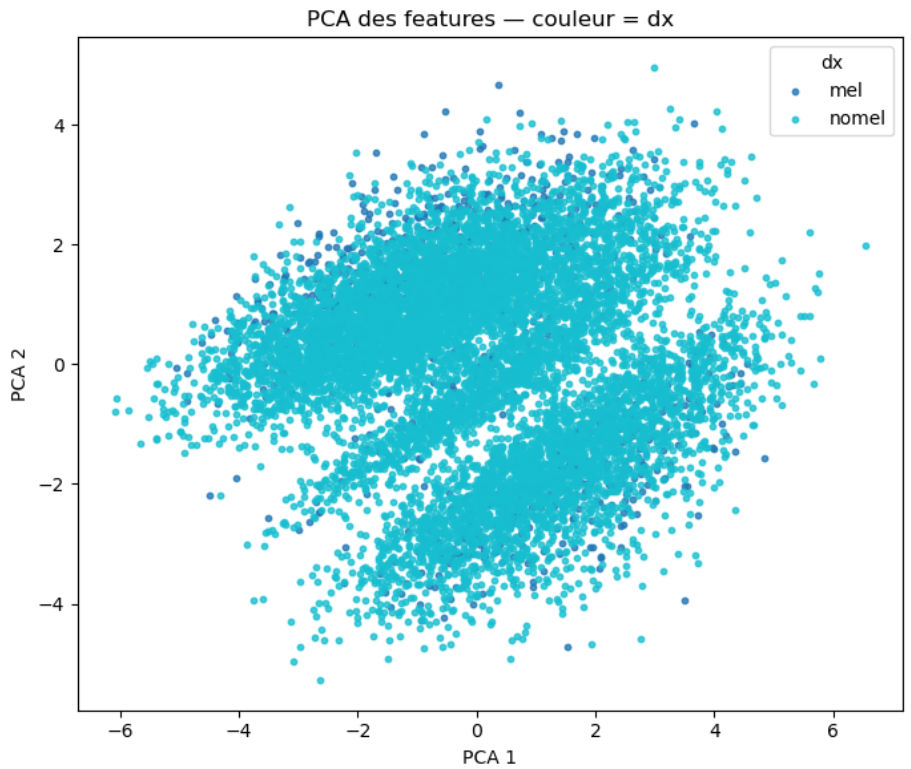
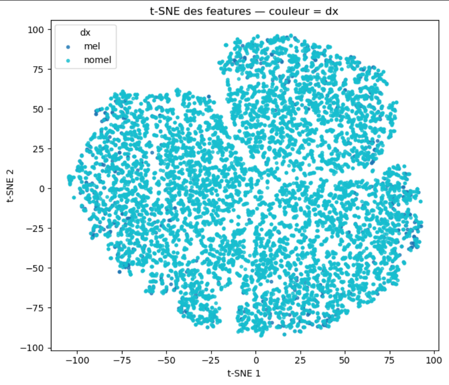

# Melanoma Detection with Machine and Deep Learning
Binary classification of skin lesions using dermoscopic images.

> ⚠️ This project is a research and learning experiment for Isep.  

## 1. Project Overview

This project explores whether tabular features derived from dermoscopic images of skin lesions can be used to automatically detect melanoma.  
The goal is to compare several machine learning models and deep learning to understand their strengths and limitations for this task.

## 2. Dataset

- Source: features extracted from the **HAM10000** dermoscopic image dataset (skin lesions).  
- Size: **10 015** samples and **21+** columns (image ID, diagnosis, clinical and engineered features).  
- Target variable:  
  - `dx = mel` → melanoma  
  - `dx = nomel` → non‑melanoma  
- Class imbalance:  
  - ~11 % melanomas, ~89 % non‑melanomas.

## 3. Methods

The workflow implemented in the notebooks and script is:

1. **Preprocessing**  
   - Label encoding of the target (`mel` / `nomel`).  
   - One‑hot encoding of categorical features (`sex`, `localization`).  
   - Missing values imputed with the mean.  
   - Train/test split with stratification (80 % / 20 %).  
   - Standardization of features with `StandardScaler`.

2. **Feature selection**  
   - Univariate feature selection with `SelectKBest` and ANOVA F‑test.  
   - Keep the 15 best features out of 33 to reduce overfitting and improve generalization.

3. **Machine learning models and hyperparameter tuning**

The following models are trained and tuned with GridSearchCV and StratifiedKFold (5‑fold), optimizing the F1‑score:

- Random Forest (`RandomForestClassifier`, class weights balanced).  
- Gradient Boosting (`GradientBoostingClassifier`).  
- Support Vector Machine (`SVC`, probability enabled, class weights balanced).  
- Logistic Regression (`LogisticRegression`, class weights balanced, `saga` / `liblinear`).

4. **Deep learning models (images)**

In addition to tabular models, two convolutional neural networks are trained directly on dermoscopic images:

- **Custom CNN built from scratch**  
  - Several convolution + pooling blocks followed by dense layers.  
  - Trained on resized lesion images with data augmentation (rotations, flips, etc. if applicable).  
  - Used as a baseline to understand how far a simple CNN can go on this task.

- **Transfer learning with VGG16**  
  - Pretrained **VGG16** backbone (ImageNet weights), used as a feature extractor.  
  - Custom classification head added on top and fine‑tuned on the melanoma vs. non‑melanoma task.  
  - Training with early stopping and validation monitoring to limit overfitting.

These deep learning models allow a direct comparison between:
- classical machine learning on engineered features, and  
- image‑based learning using CNNs (custom architecture vs. VGG16 transfer learning).

## 4. Results

### 4.1. Machine learning models (tabular features)

On the held‑out test set, after hyperparameter tuning:

- Tree‑based models and SVM reach:
  - Accuracy ≈ **0.88–0.89**  
  - F1‑score ≈ **0.94** for the best Gradient Boosting model  
  - ROC‑AUC ≈ **0.80–0.82**  

A typical result for the best Gradient Boosting model:

- Test Accuracy ≈ **0.889**  
- Test F1‑score ≈ **0.94**  
- Test ROC‑AUC ≈ **0.80**  

However, the detailed classification report reveals that:

- Performance on the non‑melanoma class is excellent.  
- Recall on the melanoma class is very poor (most melanomas are still missed), despite high global scores.

Cross‑validation (5‑fold stratified) confirms that these models are stable in terms of overall accuracy and F1‑score, but they do not provide a reliable sensitivity to melanoma cases.

Parfait, là on a de vraies infos solides à mettre dans la partie “Results” des CNN.

Voici uniquement la section 4.2 et la fin de 4.3 mise à jour, que tu peux remplacer dans ton README :

text
### 4.2. Deep learning models

Two convolutional neural networks were trained directly on dermoscopic images:

- A **custom CNN built from scratch**, used as a baseline.  
- A **VGG16‑based model** using transfer learning (pretrained on ImageNet) with a custom classification head.

On the test set (1 503 images, 1 336 non‑melanoma and 167 melanoma), both models reach a similar overall accuracy of about **0.90**, but their behaviour on the melanoma class is much less convincing.

**Custom CNN from scratch — confusion matrix**

- Confusion matrix: `[[1311, 25], [129, 38]]`  
  - TN = 1311, FP = 25, FN = 129, TP = 38  
- Classification report:  
  - Non‑melanoma (0): precision = 0.91, recall = 0.98, F1 = 0.94  
  - Melanoma (1): precision = 0.60, recall = 0.23, F1 = 0.33  
  - Accuracy = 0.90, macro F1 = 0.64, weighted F1 = 0.88  

**VGG16 transfer learning — confusion matrix**

- Confusion matrix: `[[1307, 29], [119, 48]]`  
  - TN = 1307, FP = 29, FN = 119, TP = 48  
- Classification report (class 0 = non‑melanoma, class 1 = melanoma):  
  - Non‑melanoma (0): precision = 0.92, recall = 0.98, F1 = 0.95  
  - Melanoma (1): precision = 0.62, recall = 0.29, F1 = 0.39  
  - Accuracy = 0.90, macro F1 = 0.67, weighted F1 = 0.88  

These results show that:

- Both CNNs classify non‑melanoma cases very well.  
- Even with transfer learning (VGG16), the recall on melanoma stays low (0.29 for VGG16, 0.23 for the custom CNN), meaning many melanomas are still misclassified as benign.

### 4.3. Interpretation

Even though several models (machine learning on tabular features and deep learning on images) achieve strong global metrics around **90 %** accuracy, the recall on melanoma cases remains too low. This project could be upgraded with a focus on the recall.  

### 4.4. Feature space visualization (PCA & t‑SNE)

To better understand the structure of the data, I projected the images / features into 2D using:

- **PCA (Principal Component Analysis)** linear projection.
- **t‑SNE** non‑linear projection focusing on local neighborhoods.

In both plots, each point corresponds to one lesion, colored by its label (melanoma vs. non‑melanoma).
These visualizations show that:
- the two classes are only partially separable in the chosen feature space;
- many melanoma points remain mixed with non‑melanoma ones, which helps explain why classification is challenging.
- Melanoma features tends to be extreme on many points